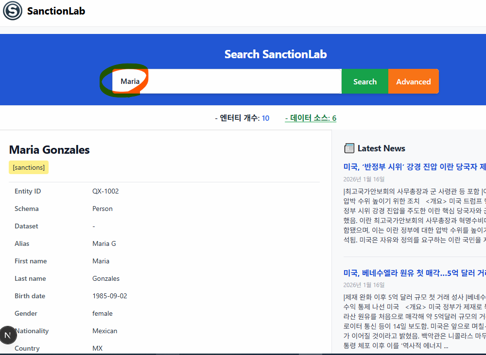

# OpenSanctions 

## 이 저장소 권장 실행 환경 (WSL Ubuntu + Next.js UI)

- 이 저장소의 기본 개발 환경은 **WSL2 기반 Ubuntu**를 권장합니다.
- UI(`ui/`)는 Next.js 기반이며, **Ubuntu 터미널에서 Node.js 22 LTS**로 실행하는 것을 권장합니다.
- `ui/package.json`의 Next.js 실행 관련 핵심 모듈(`next`, `react`, `react-dom`, `eslint-config-next`)은 최신 15.x/19.x 계열을 추적하도록 상향했습니다.

### Ubuntu(WSL)에서 UI 실행

```bash
cd ui
nvm use   # ui/.nvmrc(22) 기준
npm install
npm run dev
```

## 사전에 WSL(WSL2) 설치/관리 + 여러 리눅스 배포판 설치 + Docker Desktop(WSL2) 공유 정리

> 기준: Windows 10/11에서 **WSL2**를 사용하는 일반적인 케이스  
> PowerShell(관리자 권한)에서 실행해야 하는 명령은 ✅로 표시했습니다.

---

## 0) 빠른 결론 (Docker Desktop + WSL2)
- **Docker Desktop + WSL2 백엔드 + WSL Integration 사용**이면  
  → Windows와 WSL Linux는 **같은 Docker 엔진을 공유**하므로 **이미지/컨테이너가 공유**됩니다.
- WSL Ubuntu 안에 **docker-ce를 별도로 설치**하고 그 안에서 `dockerd`를 따로 띄우면  
  → Docker Desktop 엔진과 **분리**되어 **공유되지 않습니다.**

---

## 1) WSL/WSL2 설치 (가장 쉬운 방법)
### 1-1) WSL 설치/기본 세팅 (권장)
✅ **PowerShell(관리자)**:
```powershell
wsl --install
```

- 기본으로 Ubuntu가 함께 설치되는 경우가 많습니다.
- 설치 후 재부팅이 필요할 수 있어요.

### 1-2) WSL 상태/버전 확인
```powershell
wsl --status
```

### 1-3) WSL 업데이트 (커널 업데이트)
✅ PowerShell(관리자):
```powershell
wsl --update
```

### 1-4) 기본 WSL 버전을 WSL2로 지정
```powershell
wsl --set-default-version 2
```

---

## 2) 설치 가능한 리눅스 목록 조회 & 여러 배포판 설치
### 2-1) 설치 가능한 배포판(온라인) 목록 보기
```powershell
wsl --list --online
# 또는 축약
wsl -l -o
```

### 2-2) 원하는 배포판 설치
예: Ubuntu / Debian / Kali / openSUSE 등
```powershell
wsl --install -d Ubuntu
wsl --install -d Debian
wsl --install -d kali-linux
```

> 배포판 이름은 `wsl -l -o` 결과에 표시된 이름을 그대로 쓰면 됩니다.

---

## 3) 현재 설치된 WSL 배포판 목록 보기 (설치 목록)
### 3-1) 설치된 배포판 목록
```powershell
wsl --list
# 축약
wsl -l
```

### 3-2) 설치된 배포판 + WSL 버전(1/2)까지 보기 (추천)
```powershell
wsl --list --verbose
# 축약
wsl -l -v
```

---

## 4) 실행/접속/기본 배포판 관리
### 4-1) 특정 배포판 실행(접속)
```powershell
wsl -d Ubuntu
wsl -d Debian
```

### 4-2) 특정 배포판에서 특정 명령만 실행
```powershell
wsl -d Ubuntu -- uname -a
wsl -d Debian -- cat /etc/os-release
```

### 4-3) 기본 배포판 지정
```powershell
wsl --set-default Ubuntu
```

### 4-4) 실행 중인 배포판 종료
- 전체 WSL 종료:
```powershell
wsl --shutdown
```

- 특정 배포판만 종료:
```powershell
wsl --terminate Ubuntu
```

---

## 5) WSL1 ↔ WSL2 변환/설정
### 5-1) 특정 배포판을 WSL2로 변경
```powershell
wsl --set-version Ubuntu 2
```

### 5-2) 특정 배포판을 WSL1로 변경(특수 목적)
```powershell
wsl --set-version Ubuntu 1
```

---

## 6) 배포판(리눅스) 삭제/백업/복원
### 6-1) 배포판 완전 삭제(주의!)
```powershell
wsl --unregister Ubuntu
```
> ⚠️ 해당 배포판의 파일시스템/데이터가 모두 삭제됩니다.

### 6-2) 배포판 백업(export)
```powershell
wsl --export Ubuntu C:\backup\ubuntu.tar
```

### 6-3) 배포판 복원(import) - 새 이름으로 가져오기
```powershell
wsl --import UbuntuRestored C:\WSL\UbuntuRestored C:\backup\ubuntu.tar --version 2
```

---

## 7) Windows ↔ WSL 파일 경로/접근
### 7-1) WSL에서 Windows 드라이브 접근
- C드라이브:
```bash
cd /mnt/c
```

### 7-2) Windows 탐색기에서 WSL 파일 보기
- 탐색기 주소창에 입력:
```text
\\wsl$\Ubuntu
```

### 7-3) 현재 WSL 디렉터리를 Windows 탐색기로 열기
WSL(리눅스)에서:
```bash
explorer.exe .
```

---

## 8) 네트워크/포트 관련 빠른 팁
- WSL2는 내부적으로 가상 네트워크를 쓰므로 IP가 달라질 수 있어요.
- 보통은 `localhost` 포트 포워딩이 동작하지만, 방화벽/보안 설정에 따라 예외가 있을 수 있습니다.
- WSL에서 현재 IP 확인:
```bash
ip addr
```

---

## 9) 자주 쓰는 “운영” 명령 모음 (치트시트)
### 9-1) 현재 설치/실행 현황 빠르게 보기
```powershell
wsl -l -v
wsl --status
```

### 9-2) 특정 배포판에서 패키지 업데이트 (Ubuntu/Debian)
WSL(리눅스) 안에서:
```bash
sudo apt update
sudo apt upgrade -y
```

### 9-3) openSUSE 계열 예시
```bash
sudo zypper refresh
sudo zypper update -y
```

---

## 10) Docker Desktop + WSL2 “공유 엔진” 확인
### 10-1) WSL Ubuntu에서 Docker Desktop 엔진을 보는지 확인
WSL Ubuntu에서:
```bash
docker info | grep -E "Server Version|Operating System"
```

- Docker Desktop(WSL2) 관련 정보가 나오면 보통 **공유 엔진**입니다.

### 10-2) Windows에서도 같은지 확인
PowerShell에서:
```powershell
docker images
docker ps
```

---

## 11) 흔한 문제 2가지
### 11-1) “WSL이 설치는 됐는데 배포판이 없음”
- `wsl -l -o`로 목록 확인 후 `wsl --install -d <배포판명>` 실행

### 11-2) Docker 이미지가 공유가 안 되는 것 같음
- WSL Ubuntu에 `docker-ce`를 직접 설치해서 엔진을 따로 돌리고 있으면 공유가 안 됩니다.
- Docker Desktop 설정에서:
  - WSL2 백엔드 사용
  - WSL Integration에서 해당 배포판(예: Ubuntu) 체크
를 확인하세요.

---

## 12) (선택) 성능/리소스 튜닝 팁
WSL2 리소스 제한은 `C:\Users\<사용자>\.wslconfig`로 조정할 수 있습니다. (파일이 없으면 생성)

예시:
```ini
[wsl2]
memory=8GB
processors=4
swap=4GB
```

적용:
```powershell
wsl --shutdown
```
후 다시 WSL 실행하면 적용됩니다.

---


## 🎯 Purpose
**OpenSanctions**는 전 세계의 제재(Sanctions) 및 KYC/AML 관련 데이터를 수집·정제·표준화하여,  
서로 다른 국가나 기관의 데이터라도 **일관된 FollowTheMoney 엔터티(Entity)** 구조로 표현되도록 만드는 프로젝트입니다.  
이렇게 구조화된 데이터는 **데이터 분석**, **공유**, **컴플라이언스 검증(KYC/AML)** 등에 활용됩니다.

---

## 📁 Repository Structure

### `zavod/`
- **핵심 ETL 프레임워크**
- 크롤러(crawler)를 위한 메타데이터 모델, 엔터티 추상화, 컨텍스트 헬퍼를 정의
- `zavod`라는 Python 패키지로 배포되며, CLI 명령어(`zavod crawl`) 제공

> 예: `zavod crawl datasets/us/ofac.yml`

---

### `datasets/`
- 각 제재 소스별 YAML 정의 파일과 선택적 Python 크롤러 코드 포함  
- 실행 명령: `zavod crawl <dataset.yml>`  
- 수행 결과:
  - 원본 데이터 다운로드
  - 엄격한 파싱(모호한 경우 실패)
  - 출력: `data/datasets/<dataset명>/`
- **lookup** 파일로 잘못된 값 수동 정정 가능

---

### `contrib/`
- 운영/QA용 보조 스크립트 포함  
- 예: `aggregate_issues.py` — 크롤링 중 발생한 이슈를 통합 검토용으로 집계

---

### `analysis/`
- 데이터 품질 및 제재 프로그램 범위를 분석하는 SQL 스니펫과 리서치 노트 포함  
- 예: 제재 기관별/프로그램별 데이터 조인 및 통계 검토 쿼리

---

### `ui/`
- **Next.js 기반 데이터 검토 및 편집 UI**
- 주요 기술:
  - React 18
  - Bootstrap 스타일
  - CodeMirror 에디터
  - `@opensanctions/followthemoney` 통합
- 역할: 크롤링 결과 검토 및 수정 인터페이스 제공

---

### `Dockerfile`
- Ubuntu 24.04 기반 멀티 스테이지 빌드  
- `zavod` 패키지 설치 및 Poppler, LevelDB 등 의존성 설정  
- 기본 실행 명령어: `zavod`

---

### `docker-compose.yml`
- 대부분의 데이터셋을 자동으로 **ETL 일괄 처리**  
- 특정 내부/대용량 데이터셋은 제외  
- 실패한 데이터셋은 `failed_datasets.md`에 기록

---

## 🐳 로컬 Docker 실행 (PostgreSQL 포함)

로컬 Docker 환경에서는 `docker-compose.yml`이 PostgreSQL과 UI를 함께 띄우도록 구성되어 있습니다.  
`.env`의 `POSTGRES_*` 값을 필요에 따라 변경한 뒤 아래 명령으로 실행하세요.

```bash
docker compose up -d db
docker compose run --rm zavod bash -c "export DATABASE_URL=postgresql://postgres:password@db:5432/dev && zavod crawl datasets/nl/terrorism_list/nl_terrorism_list.yml && zavod export datasets/nl/terrorism_list/nl_terrorism_list.yml && zavod load-db datasets/nl/terrorism_list/nl_terrorism_list.yml"
docker compose up -d web
```

UI 접속: http://localhost:3000  
PostgreSQL 접속: localhost:5432

---

## 🐧 WSL Ubuntu 실행 가이드

WSL2 기반 Ubuntu에서 실행하려면 **Docker 엔진이 WSL에 연결**되어 있어야 합니다.
다음 흐름으로 준비하면 안정적으로 동작합니다.

1. **WSL2 설치 및 Ubuntu 배포판 준비**
2. **Docker 엔진 준비 (둘 중 하나)**
   - Docker Desktop 설치 후 **WSL Integration** 활성화
   - 또는 WSL 내부에 Docker Engine 설치 (`systemd` 활성화 권장)
3. **WSL 홈 디렉터리에 저장소 클론**
   - 예: `/home/<user>/opensanctions3` (Windows 파일시스템(`/mnt/c/...`)은 성능 저하 가능)
4. **Docker 동작 확인**
   ```bash
   docker info
   docker compose version
   ```
5. **실행**
   ```bash
   ./start.sh
   ```

> WSL에서는 Linux UID/GID가 중요하므로 `start.sh`가 자동으로 `LOCAL_UID/LOCAL_GID`를 주입해
> 파일 권한 이슈를 줄입니다. 필요 시 `.env`에 동일 값을 직접 설정해도 됩니다.

---

### `start.sh` / `start.ps1`
- **통합 실행 스크립트** (Linux/Windows)
- 주요 기능:
  1. 컨테이너 초기화 및 PostgreSQL 시작  
  2. `zavod crawl → export → load-db` 실행  
  3. UI 자동 구동  

---

### `Makefile`
- 프로젝트 관리 명령어 모음  
  ```bash
  make build      # 도커 이미지 빌드
  make shell      # 컨테이너 내부 진입
  make crawl      # 기본 파이프라인 실행
  make clean      # 임시 파일 정리


## DB 설치 후
```Powershell
Get-Content .\opensanctions_schema.sql -Raw | docker exec -i opensanctions3-db-1 psql -U postgres -d dev
```
---
```bash
docker exec -i opensanctions3-db-1 psql -U postgres -d dev < opensanctions_schema.sql
```
## sample data insert
```
Get-Content -Raw .\sample_data_insert.sql | docker exec -i opensanctions3-db-1 psql -U postgres -d dev
```

## 입력 중 오류 시 roll back
```
docker exec -it opensanctions3-db-1 psql -U postgres -d dev -c "ROLLBACK;"
```

## 최종 실습 및 화면 예시


## Chat GPT
https://chatgpt.com/share/6969debb-a8c8-8007-85a1-8c584ad7daa0
